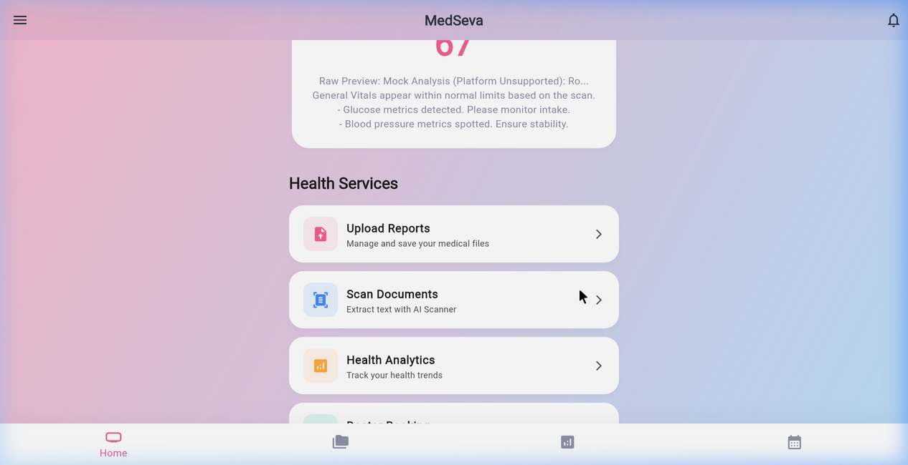
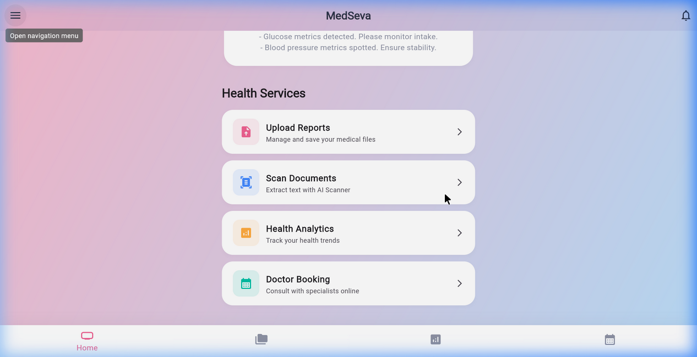
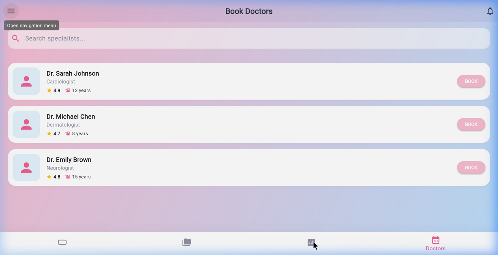
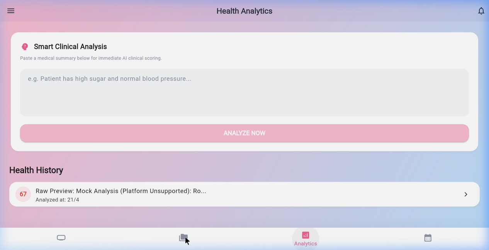

# 🏥 MedSeva Telemedicine App

> **🚀 Live Demo: [https://tanikasri.github.io/Medseva-Telemedicine-App](https://tanikasri.github.io/Medseva-Telemedicine-App)**

A fully **offline-first** Flutter telemedicine app with on-device OCR, local data persistence using Hive, and a dynamic health dashboard — no backend required!

---

## 📱 Screenshots

### Home Screen (with Live Health Score)


### Doctor Booking


### Health Analytics


### Medical Reports


---

## ✅ Features

| Feature | Status |
|---|---|
| 📄 Medical Reports Upload | ✅ Working |
| 🔍 OCR Scanner (On-Device) | ✅ Working (Android/iOS native), Web fallback |
| 📊 Dynamic Health Dashboard | ✅ Updates from Hive data |
| 🏥 Doctor Booking | ✅ Full date/time selection, saves offline |
| 💾 Offline Persistence (Hive) | ✅ All data survives app restarts |

---

## 🏗️ Architecture

```
lib/
├── core/
│   ├── models/          # Hive data models (Report, HealthSummary, Appointment)
│   ├── theme/           # App colors and theme
│   └── widgets/         # Shared widgets (BottomNavBar, MainShell)
├── features/
│   ├── auth/            # Login & Registration (SharedPreferences)
│   ├── dashboard/       # Home screen, Health Dashboard
│   ├── reports/         # Report upload & listing (local file + Hive)
│   ├── scanner/         # OCR Scanner (Google ML Kit on Android/iOS)
│   ├── analytics/       # Health Analytics screen
│   └── doctors/         # Doctor listing & appointment booking
└── main.dart            # Hive initialization + Provider setup
```

---

## 🛠️ Tech Stack

- **Flutter** (Dart) — Cross-platform UI
- **Hive** — Fast local NoSQL database (offline persistence)
- **Provider** — State management
- **Google ML Kit** — On-device text recognition (OCR)
- **path_provider** — Local file system access
- **image_picker** — Camera/gallery access
- **uuid** — Unique ID generation

---

## 🚀 How to Run

### Prerequisites
- Flutter SDK installed
- Android emulator, iOS simulator, or Chrome browser

### Steps

```bash
# Navigate to the Flutter project directory
cd Medseva-Telemedicine-App-main

# Install dependencies
flutter pub get

# Generate Hive adapters
flutter pub run build_runner build --delete-conflicting-outputs

# Run on Android (recommended for full OCR support)
flutter run -d android

# Run on Chrome (web - uses mock OCR fallback)
flutter run -d chrome
```

---

## 📝 Notes

- **OCR on Web/Desktop**: Google ML Kit is a native SDK and only supports Android/iOS. When running on Chrome, the app automatically uses a smart mock OCR response that still exercises the full data pipeline (score generation → Hive save → Dashboard update).
- **All data is local**: No internet connection required. Reports, health summaries, and appointments are all stored on-device using Hive.
